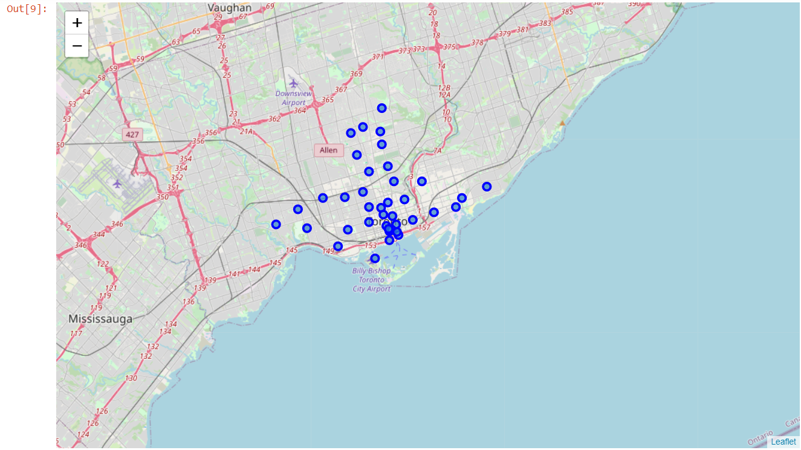
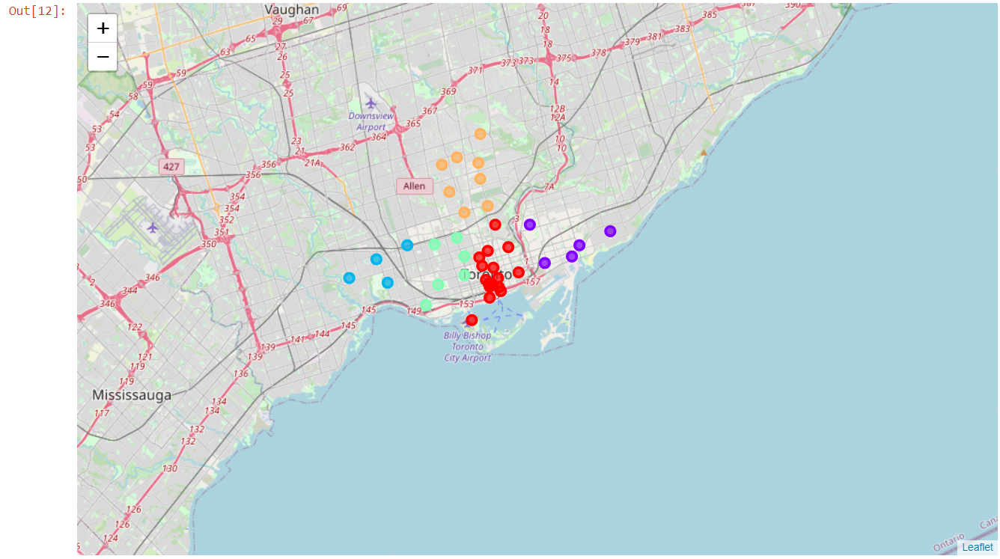

# applied-data-science-capstone
This is the Project of the Applied Data Science Capstone

Week 01

Create a new repository on your Github account and name it Coursera_Capstone.
Now, start a Jupyter Notebook using any platform that you are comfortable with and do the following:

Write some markdown to explain that this notebook will be mainly used for the capstone project.
Import the pandas library as pd.
Import the Numpy library as np.
Print the following the statement: Hello Capstone Project Course!
Push the Notebook to your Github repository and submit a link to the notebook on your Github repository.

Week 03

This week's assigment is about clustering Totonto Neighbohoods.
The maps generated using the Folium library are shown below:

Week 04

This week's assignment is available at the final_project folder.
The submission is related to the files:
introduction-business_problem.txt
data.txt

Week 05

This week's assignment is available at the final_project folder.
The submission is related to the files:
The_Battle_of_Neighborhoods.ipynb
brazilian_rest_ny_tocsv1.csv
brazilian_rest_stats_ny_csv.csv
